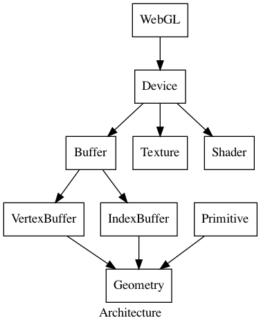

#+TITLE: Architecture

#+begin_src dot :file archiecture.png :exports results
digraph Architecture {
    label = Architecture;
    node[shape=box];

    WebGL -> Device;
    Device -> { Buffer, Texture, Shader };
    Buffer -> { VertexBuffer, IndexBuffer };

    VertexBuffer -> Geometry;
    IndexBuffer -> Geometry;
    Primitive -> Geometry;
}
#+end_src

#+RESULTS:

