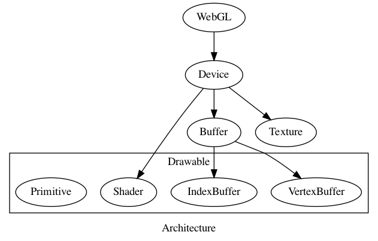

#+TITLE: Architecture

#+begin_src dot :file archiecture.png :exports results
digraph Architecture {
    compound = true;
    label = Architecture;

    WebGL -> Device;
    Device -> { Shader, Buffer, Texture };
    Buffer -> { VertexBuffer, IndexBuffer };

    subgraph cluster_Drawable {
        label = "Drawable";

        VertexBuffer;
        IndexBuffer;
        Shader;
        Primitive;
    }
}

#+end_src

#+RESULTS:

